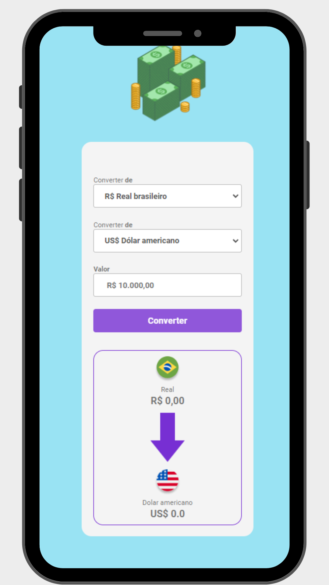

<h1 align="center" >Projeto conversor de moedas</h1>
 
 
<section>
  

     
    

  

    <h2>Tecnologias utilizadas</h2>
     
     
    
    
    
     
     
    
Projeto que aprendi no <a href="https://rodolfomori.com.br/devclub/">DevClub</a>

    
  

</section>

